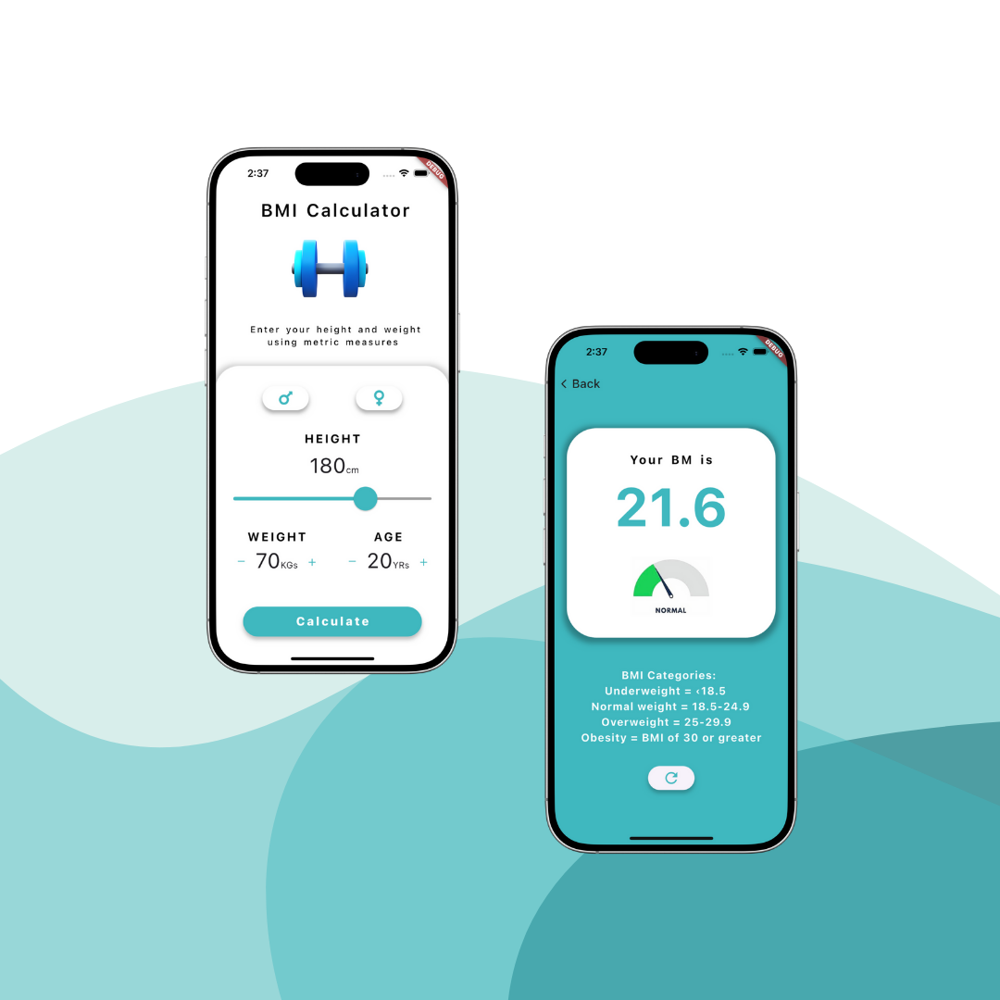

# BMI Calculator (Flutter)

A simple, responsive Body Mass Index (BMI) Calculator built with Flutter. Enter your height and weight (metric units) to compute BMI and see your category at a glance with a friendly UI and illustrative images.

> Platforms: Android, iOS, Web, macOS, Windows, Linux (Flutter multiplatform).


## ✨ Features

- Metric-based BMI calculation using the standard formula
- Gender selection (visual only; does not change the formula)
- Height slider (120–210 cm)
- Weight and age steppers (± buttons)
- Instant results screen with category image:
	- Underweight, Normal, Overweight, Obese, Extreme Obesity
- Custom theming and typography (Raleway font)
- Works on mobile and the web


## 📸 Preview




## 🧱 Project structure

```text
bmi_calculator/
├─ lib/
│  └─ main.dart           # App entry, UI, navigation, and BMI logic
├─ images/                # Category images + artwork
├─ fonts/
│  └─ Raleway-VariableFont_wght.ttf
├─ android/               # Native Android project
├─ ios/                   # Native iOS project
├─ web/                   # Web resources
├─ macos/, windows/, linux/  # Desktop targets
├─ pubspec.yaml           # Dependencies, assets, fonts
└─ README.md
```


## 🧠 How it works

BMI is calculated as:

Inline: $\text{BMI} = \frac{\text{weight (kg)}}{\text{height (m)}^2}$

Given height is entered in centimeters in this app, it uses the equivalent form:

$$\text{BMI} = \frac{\text{weight (kg)}}{\left(\frac{\text{height (cm)}}{100}\right)^2} = \frac{\text{weight (kg)}}{\text{height (cm)} \times \text{height (cm)} / 10000}$$

Categories used in the app:

- Underweight: BMI < 18.5
- Normal: 18.5 ≤ BMI < 24.9
- Overweight: 25.0 ≤ BMI < 29.9
- Obese: 30.0 ≤ BMI < 34.9
- Extreme Obesity: BMI ≥ 35.0


## 🏗️ Architecture and key widgets

- `MyApp` – Root of the app, sets up `MaterialApp`.
- `HomeScreen` – Main input screen:
	- Gender selection via two `GenderButton`s (Mars/Venus icons)
	- Height slider (cm)
	- Weight and age with +/− buttons
	- “Calculate” button navigates to the result screen
	- State managed with `setState` (local component state)
- `ResultScreen` – Shows the computed BMI, large numeric display, and a category image based on the BMI value. Includes a “Back/Refresh” option.
- `GenderButton` – Reusable button with selected/unselected styling.

Navigation uses Flutter’s `Navigator.push`/`pop` with a `MaterialPageRoute`.


## 🧩 Dependencies

Defined in `pubspec.yaml`:

- Flutter SDK
- `cupertino_icons` – iOS-style icons
- `awesome_icons` – Font Awesome icon pack for gender icons
- `flutter_lints` (dev) – Static analysis rules

Assets and fonts are declared in `pubspec.yaml`:

```yaml
flutter:
	uses-material-design: true
	assets:
		- images/
	fonts:
		- family: Raleway
			fonts:
				- asset: fonts/Raleway-VariableFont_wght.ttf
```


## 🚀 Getting started

### Prerequisites

- Flutter (stable channel) with Dart SDK 3.5 or newer
- A device or emulator/simulator for your target platform(s)

Verify your environment:

```bash
flutter --version
flutter doctor
```

### Install and run

```bash
# Fetch packages
flutter pub get

# Run on a connected device or simulator (pick one):
flutter run -d android     # Android emulator/device
flutter run -d ios         # iOS Simulator / device (macOS + Xcode required)
flutter run -d chrome      # Web (Chrome)
flutter run -d macos       # macOS desktop
flutter run -d windows     # Windows desktop
flutter run -d linux       # Linux desktop
```


## 🕹️ Using the app

1. Select your gender (optional; visual only)
2. Slide to set your height in centimeters
3. Use +/− to set your weight in kilograms (and age if desired)
4. Tap “Calculate”
5. View your BMI number and category image


## 🧪 Testing

The repository contains a template widget test in `test/widget_test.dart` from the default Flutter starter. It doesn’t reflect this app’s UI and may fail.

Recommendations:

- Replace the template with tests relevant to this UI
- Consider extracting the BMI calculation into a pure Dart utility for easy unit testing

Run tests:

```bash
flutter test
```


## 📦 Building production artifacts

General release builds:

```bash
flutter build apk        # Android APK (debug signing unless configured)
flutter build appbundle  # Android AAB for Play Store
flutter build ipa        # iOS IPA (requires signing set up in Xcode)
flutter build web        # Web bundle in build/web
flutter build macos      # macOS app
flutter build windows    # Windows app
flutter build linux      # Linux app
```


## 🛫 Deployment guides

### Android (Google Play)

1) App ID and versioning

- Update `applicationId` in `android/app/build.gradle` (e.g., `com.yourcompany.bmi`).
- Keep `versionCode` / `versionName` in sync (managed by Flutter via `pubspec.yaml`).

2) App signing (release)

- Create a keystore (one-time):

```bash
keytool -genkey -v -keystore ~/bmi-upload-keystore.jks -keyalg RSA -keysize 2048 -validity 10000 -alias bmi-upload
```

- Create `android/key.properties`:

```properties
storePassword=YOUR_STORE_PASSWORD
keyPassword=YOUR_KEY_PASSWORD
keyAlias=bmi-upload
storeFile=/Users/you/bmi-upload-keystore.jks
```

- Configure signing in `android/app/build.gradle` (release block) if not already present. In Flutter templates, you typically add:

```groovy
def keystoreProperties = new Properties()
def keystorePropertiesFile = rootProject.file('key.properties')
if (keystorePropertiesFile.exists()) {
		keystoreProperties.load(new FileInputStream(keystorePropertiesFile))
}

android {
	signingConfigs {
		release {
			keyAlias keystoreProperties['keyAlias']
			keyPassword keystoreProperties['keyPassword']
			storeFile file(keystoreProperties['storeFile'])
			storePassword keystoreProperties['storePassword']
		}
	}
	buildTypes {
		release {
			signingConfig signingConfigs.release
			minifyEnabled false
			shrinkResources false
		}
	}
}
```

3) Build an App Bundle and upload

```bash
flutter build appbundle --release
```

Upload the generated `.aab` from `build/app/outputs/bundle/release/` to Google Play Console.


### iOS (App Store / TestFlight)

1) Set up signing

- Open `ios/Runner.xcworkspace` in Xcode
- Set your Team and unique Bundle Identifier
- Ensure required profiles/certificates exist (Automatic signing recommended)

2) Versioning

- Update version and build in Xcode or use `--build-name/--build-number` flags with Flutter builds

3) Build and distribute

Option A – Archive in Xcode: Product → Archive → Distribute App → App Store Connect/TestFlight

Option B – From CLI (requires Xcode signing configuration):

```bash
flutter build ipa --release
```

Upload using Xcode Organizer or Transporter.


### Web (Static hosting)

1) Build

```bash
flutter build web --release
```

2) Deploy the `build/web` folder to your static host (e.g., GitHub Pages, Netlify, Firebase Hosting).

- For GitHub Pages (project site), you may need a base href when hosting under a subpath:

```bash
flutter build web --release --base-href "/your-repo-name/"
```


### Desktop (macOS, Windows, Linux)

1) Enable desktop support (one-time per machine):

```bash
flutter config --enable-macos-desktop --enable-windows-desktop --enable-linux-desktop
flutter doctor
```

2) Build for your OS:

```bash
flutter build macos    # or windows / linux
```

Distribute per platform conventions (e.g., notarized DMG for macOS, MSI/EXE for Windows).


## 🧰 Troubleshooting

- Android Gradle/CMake errors
	- Run: `flutter clean && flutter pub get`
	- Ensure Android SDK and emulator tools are installed and up to date
- iOS CocoaPods issues
	- Ensure you have Xcode and Command Line Tools installed
	- From `ios/`: `pod repo update && pod install`
- Web blank page under subpath
	- Build with `--base-href` as shown in the Web section
- Assets not found
	- Confirm paths in `pubspec.yaml` and that files exist under `images/` and `fonts/`
- Tests failing
	- Replace or update the default starter test to match this UI


## 🗺️ Roadmap / Ideas

- Imperial units (ft/in, lbs) + unit toggle
- Persist last used values
- Accessibility improvements (semantics, contrast)
- Theming (dark mode)
- Localization (i18n)
- Extract BMI logic into a `lib/utils/bmi.dart` for testability


## 🙌 Acknowledgements

- Icons via `awesome_icons` (Font Awesome)
- Typography: Raleway
- Flutter team and community resources


## 📄 License

No license specified yet. If you plan to open-source this project, add a LICENSE file (e.g., MIT, Apache-2.0). If private, keep all rights reserved.
